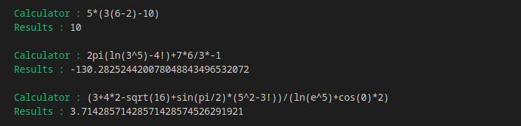
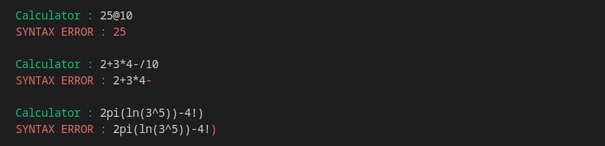
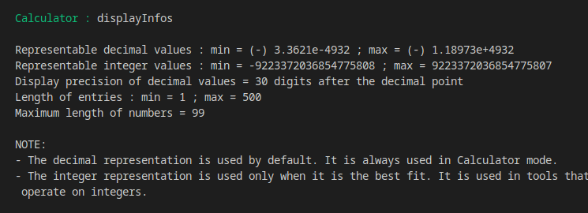
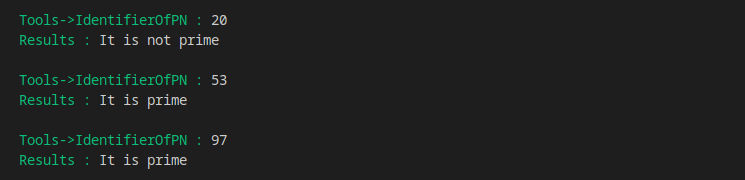

# Scientific Calculator

A command-line scientific calculator written in C.

This project is a fully-featured calculator designed to handle mathematical expressions with multiple levels of complexity. It supports standard arithmetic operators, parentheses, constants like π and e, and a wide range of mathematical functions such as sin, cos, sqrt, ln, and more. The calculator interprets expressions according to operator precedence and can manage unary and binary operations correctly.

Internally, the program transforms user input into structured representations (using lists and trees) before evaluating the result. This architecture allows it to process nested functions, implicit multiplications, and complex operator hierarchies, while ensuring syntax validity and numerical precision.

The README provides full technical documentation about how the calculator works, including the parsing rules, operator priorities, and internal evaluation pipeline. For the project’s history, motivation, and design decisions, see [HISTORY.md](HISTORY.md).


## Quick start

This section explains how to quickly build and run the calculator on your machine.

### Prerequisites

To compile and run the program, you need:

* `gcc` installed on your system (the project is written and tested with GCC)
* `make`
* The standard C math library (`libm`, usually installed by default)

If you want to use another compiler or change compilation options, you can do so by editing the `Makefile`.

### Build the project

Clone the repository:

```bash
git clone https://github.com/akabassijgos/scientific-calculator.git
cd scientific-calculator
```

Compile the calculator:

```bash
make
```

This will generate the executable named `calculator`.

### Run the calculator

To start the program:

```bash
make run
```

or directly:

```bash
./calculator
```


## Examples of usage

This section shows how the calculator looks and behaves during execution.


*Basic arithmetic operations*



*Expressions with parentheses and functions*



*Syntax error handling*



*Command usage*



*Prime number identification tool*


## What this README contains

* [Quick start](#quick-start)
* [Examples of usage](#examples-of-usage)
* [Commands](#commands)
* [Supported elements (tokens)](#supported-elements-tokens)
* [Full syntax rules](#full-syntax-rules)
* [Operator precedence & evaluation direction](#operator-precedence--evaluation-direction)
* [Internal representation: lists and trees](#internal-representation-lists-and-trees)
* [Example pipeline (what the program does for one input)](#example-pipeline-what-the-program-does-for-one-input)
* [Tests](#tests)
* [Limitations & portability](#limitations--portability)
* [Contributing](#contributing)
* [License](#license)


If you just want the program to work, the Quick start + Examples sections above are enough. Continue reading for the complete technical reference.


## Commands

The calculator can be controlled using textual commands. A command can be entered whenever the green prompt is displayed, regardless of the current mode. The available commands are:

* `setMode` : choose a mode. The program currently provides three main modes: Calculator, Tools and Documentation.
* `back` : return to the previous menu level.
* `setPrecision` : set decimal display precision (supported: 10, 20, 30).
* `displayInfos` : show representable value ranges and precision info.
* `clear` : clear the terminal screen.
* `exit` : quit the program.


## Supported elements (tokens)

User expressions may contain exactly these five element types:

1. **Numbers** : decimal positive numbers only (digits `0–9` and decimal point `.`).
2. **Operators** : `/`, `*`, `-`, `+`, `%`, `!`, `^`. The code distinguishes unary minus (`u-`) and binary minus (`b-`) internally.
3. **Constants** : `pi`, `e`.
4. **Separators (parentheses)** : `(` and `)`.
5. **External functions** : `sqrt`, `sin`, `cos`, `tan`, `ln`, `log`, `asin`, `acos`, `atan`, `exp`.

Only the tokens above are valid. Anything outside these tokens will be rejected by the syntax checker. **Even spaces are rejected** (but it might be preferable to allow them).


## Full syntax rules

Syntax validation works by checking, for each element, what is allowed **before** it (previous) and **after** it (next), plus checking that parentheses are balanced. Below are the rules applied by `syntaxAnalysis()`.


### 1) Numbers

* **Previous allowed:** Operators `/`, `*`, `u-`, `b-`, `+`, `^`, separator `(`, nothing (start of expression).

* **Previous forbidden:** another number, operators `%`, `!`, constants, separator `)`, external functions.

* **Next allowed:** Operators `/`, `*`, `b-`, `+`, `%`, `!`, `^`, constants, separators `(` or `)`, external functions, nothing (end).

* **Next forbidden:** another number, operator `u-` (unary minus cannot follow a number).


### 2) Operators

Operators are split into 4 categories; each category has specific rules.

#### Category 1: `/`, `*`, `^`

* **Previous allowed:** numbers, operators `%` or `!`, constants, separator `)`.
* **Previous forbidden:** operators `/`, `*`, `u-`, `b-`, `+`, `^`, separator `(`, external functions, nothing (i.e. can't start with `/`).
* **Next allowed:** numbers, operator `u-`, constants, separator `(`, external functions.
* **Next forbidden:** operators `/`, `*`, `b-`, `+`, `%`, `!`, `^`, separator `)`, nothing.

#### Category 2: `b-` (binary minus), `+`

* **Previous allowed:** numbers, operators `%` or `!`, constants, separator `)`.
* **Previous forbidden:** `/`, `*`, `u-`, `b-`, `+`, `^`, separator `(`, external functions, nothing.
* **Next allowed:** numbers, constants, separator `(`, external functions.
* **Next forbidden:** operators `/`, `*`, `u-`, `b-`, `+`, `%`, `!`, `^`, separator `)`, nothing.

#### Category 3: `u-` (unary minus)

* **Previous allowed:** operators `/`, `*`, `^`, separator `(`, nothing.
* **Previous forbidden:** numbers, operators `u-`, `b-`, `+`, `%`, `!`, constants, separator `)`, external functions.
* **Next allowed:** numbers, constants, separator `(`, external functions.
* **Next forbidden:** operators `/`, `*`, `u-`, `b-`, `+`, `%`, `!`, `^`, separator `)`, nothing.

#### Category 4: `%`, `!`

* **Previous allowed:** numbers, operators `%` or `!`, constants, separator `)`.
* **Previous forbidden:** `/`, `*`, `u-`, `b-`, `+`, `^`, separator `(`, external functions, nothing.
* **Next allowed:** operators `/`, `*`, `b-`, `+`, `%`, `!`, `^`, constants, separators `(` or `)`, external functions, nothing.
* **Next forbidden:** numbers, operator `u-`.


### 3) Constants (`pi`, `e`)

* **Previous allowed:** numbers, operators `/`, `*`, `u-`, `b-`, `+`, `%`, `!`, `^`, constants, separators `(` or `)`, nothing.
* **Previous forbidden:** external functions.
* **Next allowed:** operators `/`, `*`, `b-`, `+`, `%`, `!`, `^`, constants, separators `(` or `)`, external functions, nothing.
* **Next forbidden:** numbers, operator `u-`.


### 4) Separators (parentheses)

#### `(` (opening)

* **Previous allowed:** numbers, operators `/`, `*`, `u-`, `b-`, `+`, `%`, `!`, `^`, constants, separators `(` or `)`, external functions, nothing.
* **Next allowed:** numbers, operator `u-`, constants, separator `(`, external functions.
* **Next forbidden:** operators `/`, `*`, `b-`, `+`, `%`, `!`, `^`, separator `)`, nothing.

#### `)` (closing)

* **Previous allowed:** numbers, operators `%` or `!`, constants, separator `)`.
* **Previous forbidden:** operators `/`, `*`, `u-`, `b-`, `+`, `^`, separator `(`, external functions, nothing.
* **Next allowed:** operators `/`, `*`, `b-`, `+`, `%`, `!`, `^`, constants, separators `(` or `)`, external functions, nothing.
* **Next forbidden:** numbers, operator `u-`.


### 5) External functions (`sin`, `cos`, etc.)

* **Previous allowed:** numbers, operators `/`, `*`, `u-`, `b-`, `+`, `%`, `!`, `^`, constants, separators `(` or `)`, nothing.
* **Previous forbidden:** another external function.
* **Next allowed:** separator `(` (a function must be followed by `(`).
* **Next forbidden:** numbers, operators, constants, separator `)`, external functions, nothing.


## Operator precedence & evaluation direction

Operators are grouped into 4 priority levels and each group has an evaluation direction. The evaluator first groups operators by priority, then evaluates each group following the group's direction, starting from the highest-priority group down to the lowest.

| Priority | Operators | Evaluation direction |
| -------- | --------- | -------------------- |
| 1        | `!` `%`   | **Left to Right**    |
| 2        | `^` `u-`  | **Right to Left**    |
| 3        | `/` `*`   | **Left to Right**    |
| 4        | `+` `b-`  | **Left to Right**    |

* `u-` = unary minus, `b-` = binary minus.
* The implementation collects operators of the same priority, then applies them according to the group's direction.


## Internal representation: lists and trees

The calculator works in multiple passes. The main idea:

* **Step 1: string ➔ list**: `stringToList()` converts the input into a doubly-linked list. Each node is an `OperationObject` (number, operator, function name, separator, constant).
* **Step 2: validation & pre-processing**: `syntaxAnalysis()` checks rules above; `manageAllConstants()` replaces named constants with specific external function calls; `manageImplicitMultiplications()` inserts explicit `*` when needed (e.g. `2pi` ➔ `2 * pi`).
* **Step 3: build tree**: The list is wrapped in a root block, `fillTree()` builds `Block` structures representing nested parenthesis blocks and sub-blocks.
* **Step 4: transform list with manage...**: `manage...` functions operate on lists and tree blocks to convert the expression into an internal "functional" form with short internal names (e.g. `ad` for add, `mu` for multiply, `td` for toDecimal). These functions include: `manageNumber`, `manageOperator`, etc.
* **Step 5: evaluate**: `listToString()` converts the final list into a string formatted for `operate()`, which calls the internal arithmetic functions recursively to compute the result.


## Example pipeline (what the program does for one input)

User types: `2+3*4`

1. `stringToList("2+3*4")` ➔ list: `["2","+", "3", "*", "4"]`
2. `syntaxAnalysis(list)` ➔ OK
3. `manageAllConstants()` ➔ no change
4. `manageImplicitMultiplications()` ➔ no change
5. `fillTree()` ➔ creates a root block; insert surrounding parentheses first
6. `manageAllObjects(tree)` ➔ transforms list into internal form `["ad", "(", "td", "(", "2", ")", ",", "mu", "(", "td", "(", "3", ")", ",", "td", "(", "4", ")", ")", ")"]`
7. `listToString()` ➔ `"ad(td(2),mu(td(3),td(4)))"`
8. `operate(...)` evaluates recursively:

   * evaluate `mu(td(3),td(4))` ➔ `12`
   * evaluate `ad(td(2),12)` ➔ `14`
9. Result `14` printed with the user precision.


## Tests

The project includes a basic test program used to validate parts of the calculator engine. At the moment, **tests are still manual** and are not based on any testing framework.

To build and run the test program, simply use:

```bash
make run-tests
```

This command:

1. Compiles the calculator source files (excluding `main.c`)
2. Compiles the test file located in the `tests` directory
3. Links everything into a dedicated test executable
4. Runs the test program

The output is printed directly in the terminal. Results must currently be interpreted manually by the user.


## Limitations & portability

* `long double` is used for precision. On some platforms `long double` is extended precision; on others it behaves like `double`. Results may differ slightly across systems.
* Some math helpers (`isnanl`, `isinfl`, etc.) may be exposed differently depending on the compiler, standard library, and language standard used. For this reason, the project currently relies on default compiler extensions rather than enforcing a strict C standard. This helps avoid missing symbols on common toolchains across different platforms.
* The parser is strict: expressions must follow the syntax rules above. The design chooses safety and predictability over permissive parsing.
* No graphical user interface: the program runs only from the command line.


## Contributing

This project is mainly a learning and experimentation project, so contributions are welcome. Bug fixes, small improvements, refactoring or discussions around the design are all appreciated.

One known limitation concerns the percent operator (%). It is currently implemented in a very simple way and only divides its operand by 100. Other calculators sometimes apply more contextual behaviors (for example in expressions like 50 + 10%). Improving or redefining this behavior would be a good contribution, as long as the rules remain clear and consistent with the rest of the engine.

There are also several possible extensions, such as adding new mathematical functions, introducing a degree mode for trigonometric functions, or improving the testing approach. Tests are still manual for now, and setting up a proper testing framework is planned for later.

### Contribution workflow

If you want to contribute to this project:

1. Fork the repository on GitHub.
2. Create a new branch for your changes.
3. Make your changes and test them locally.
4. Keep commits small and clear when possible.
5. Open a pull request with a short explanation of what you changed and why.

If your contribution modifies parsing rules, operator behavior, or syntax validation, please explain the reasoning behind the change, as these parts are tightly coupled and can easily introduce regressions.


## License

This project is distributed under the MIT license.

